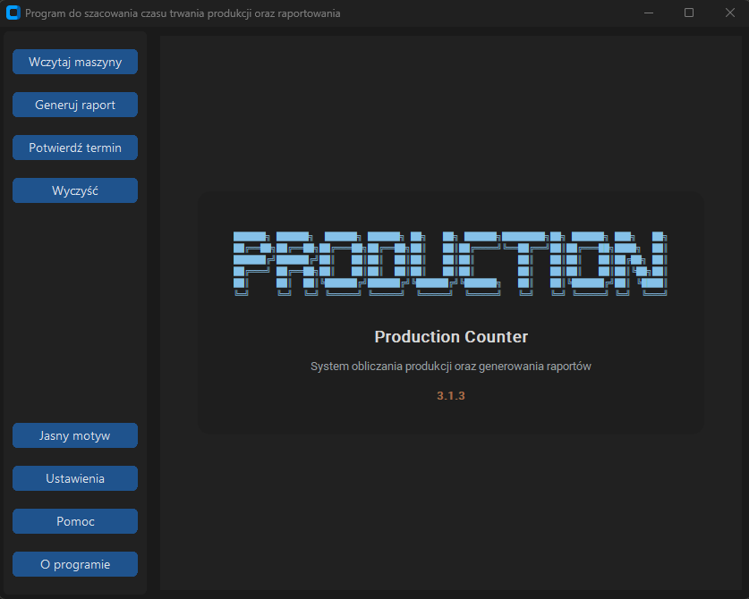

# Production Calculation Program

Production Calculation and Reporting System

## 📷 Screenshots

### Main Application Dashboard

## 🚀 Key Features

- **Automated Data Refresh:** Continuous monitoring of the availability of new reports for a given machine. The program checks every 30 seconds to see if a new document has appeared on the server's hard drive.
- **Geometry & BOM Management:** Streamlined processing of profile indices, assembly configurations, and custom foil cutting parameters.
- **Auto-Update Notification System:** Built-in version checking mechanism that automatically triggers a pop-up window notifying the user whenever a newer release is deployed on the network server.